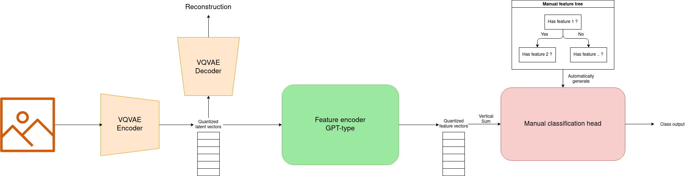

# Concept_ZSL

## Pipeline

We pass the image to the VQVAE, the path is split between the quantized latent vectors and the reconstruction. The reconstruction is used for the loss and the latent vectors are passed to a GPT-type model. From the latent vectors, we generate n features. We sum the features vertically and create a custom Sequential model where the weights are made to split the sums into their respective classes.

